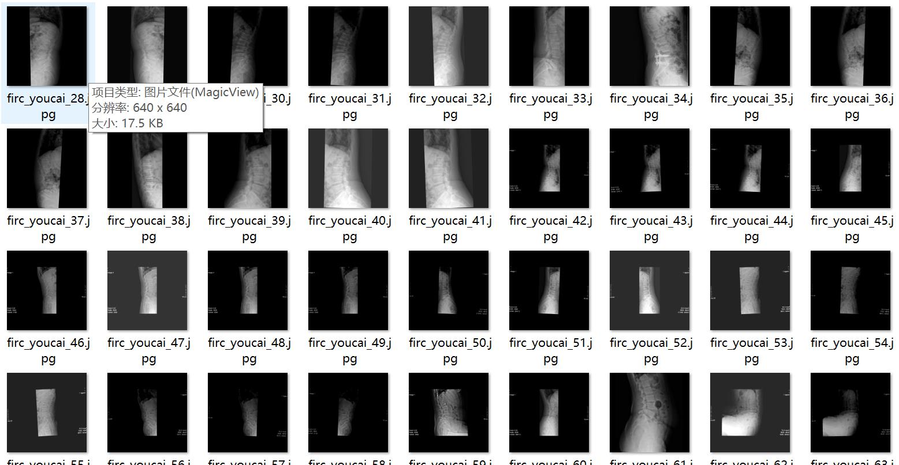
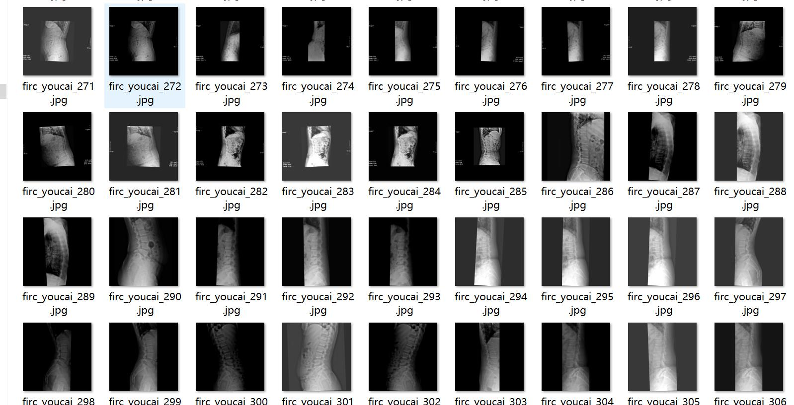
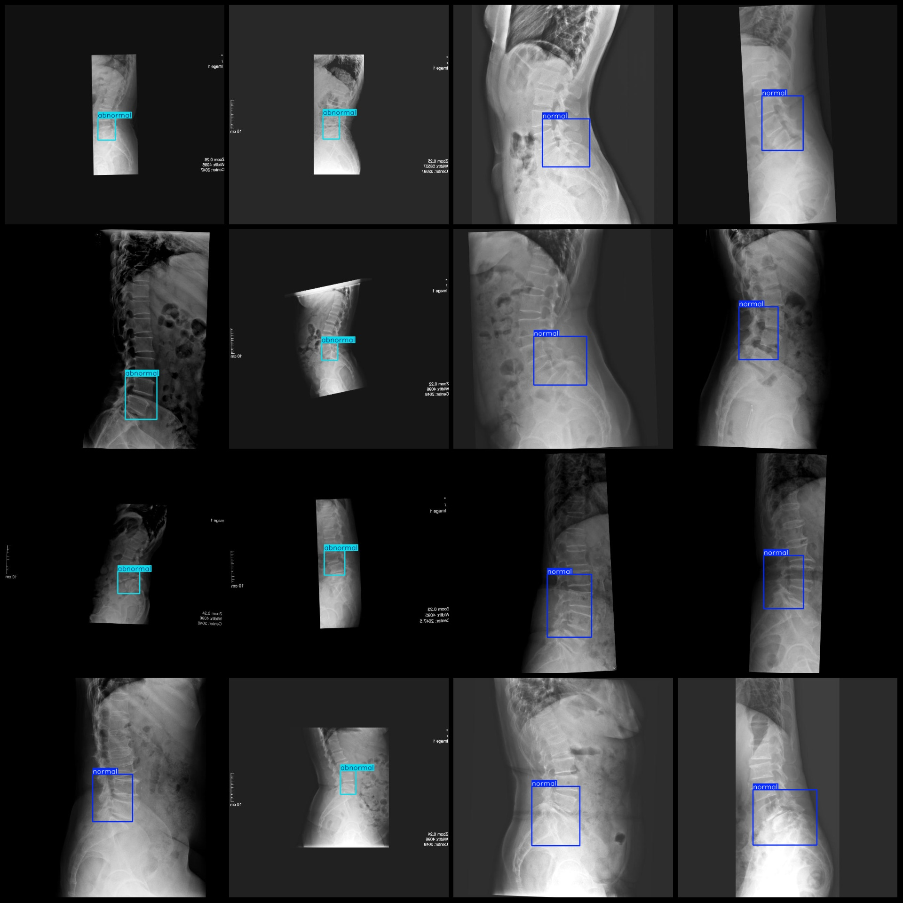

# Smart Medical MRI Image Lumbar Spine Dislocation Detection Dataset VOC+YOLO Format with 1261 Images in 2 Categories

Note: Approximately 500 images are original, the remaining are enhanced images.
Dataset format: Pascal VOC format + YOLO format (txt file without segmentation path, only containing jpg images along with corresponding VOC format xml files and YOLO format txt files)
Number of images (jpg file count): 1261
Number of annotations (xml file count): 1261
Number of annotations (txt file count): 1261
Number of annotation categories: 2
Annotation category names (note that the order of labels in the YOLO format does not correspond to this, but is based on the labels folder 'classes.txt'): ["abnormal", "normal"]
Number of bounding boxes per category:
- abnormal bounding box count = 439
- normal bounding box count = 822
Total bounding boxes: 1261
Number of images each category occupies:
- abnormal images occupy = 439
- normal images occupy = 822
Image resolution: 640x640
Annotation tool used: labelImg
Annotation rules: Draw a rectangle around the category
Important note: The dataset does not have separate training, validation, or test sets; you need to partition them yourself.
Special statement: This dataset does not guarantee the accuracy of the trained models or weight files.
Image preview:
Annotation example:

## Image

Here is a pay link on Stripe ( https://buy.stripe.com/3cs8yP7sY87d0vu9AB ). Please contact me lonlonago@foxmail.com after funding $89, and I will send you a complete data files , thank you!

